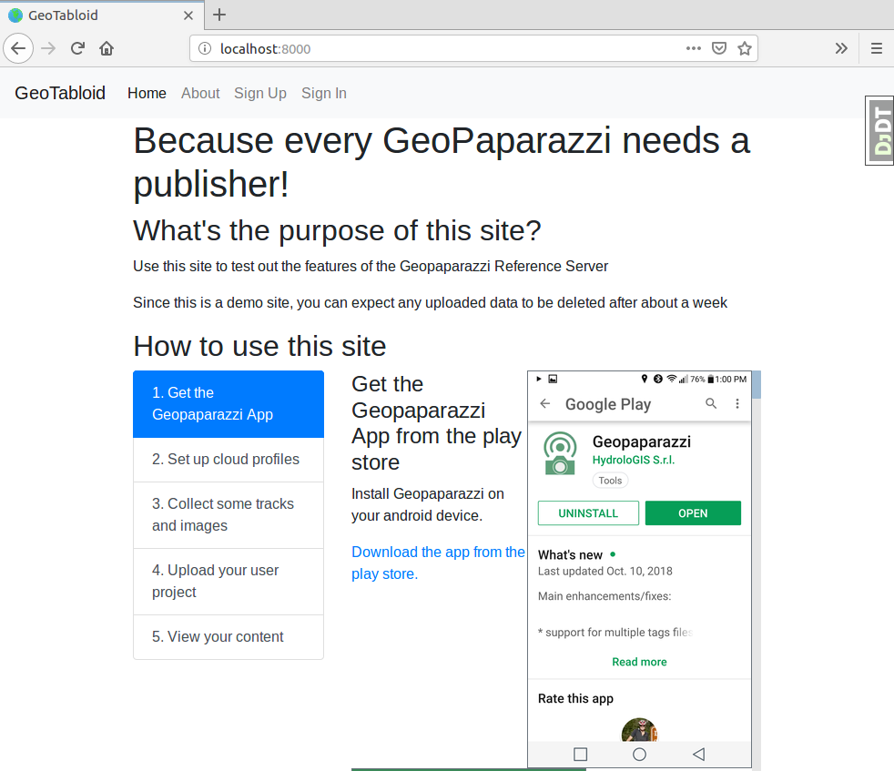
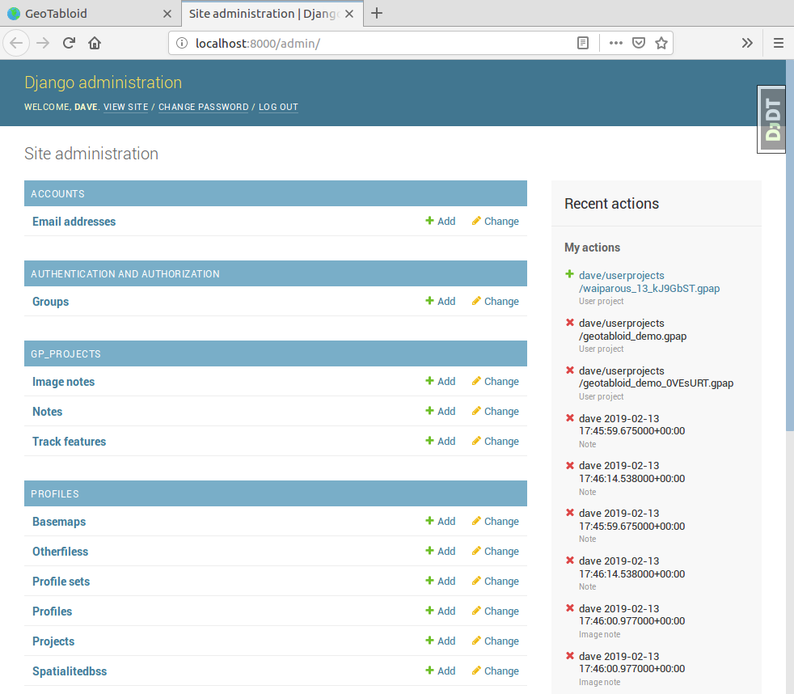
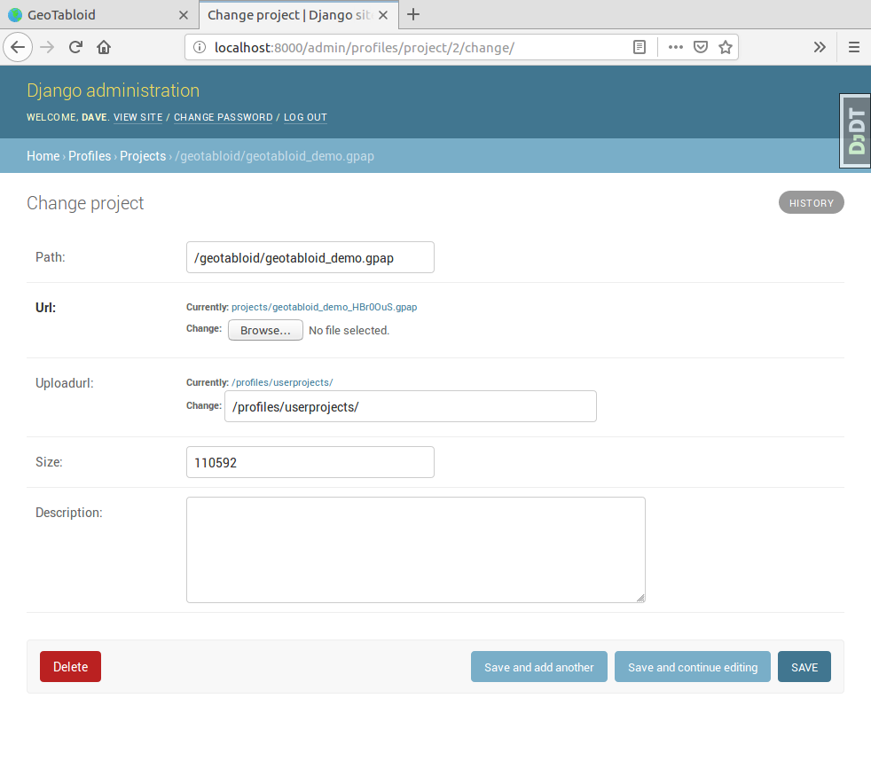
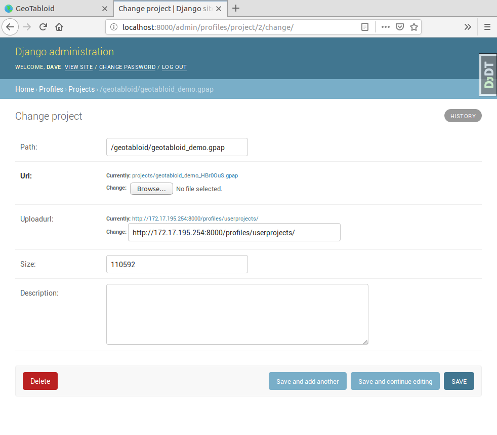
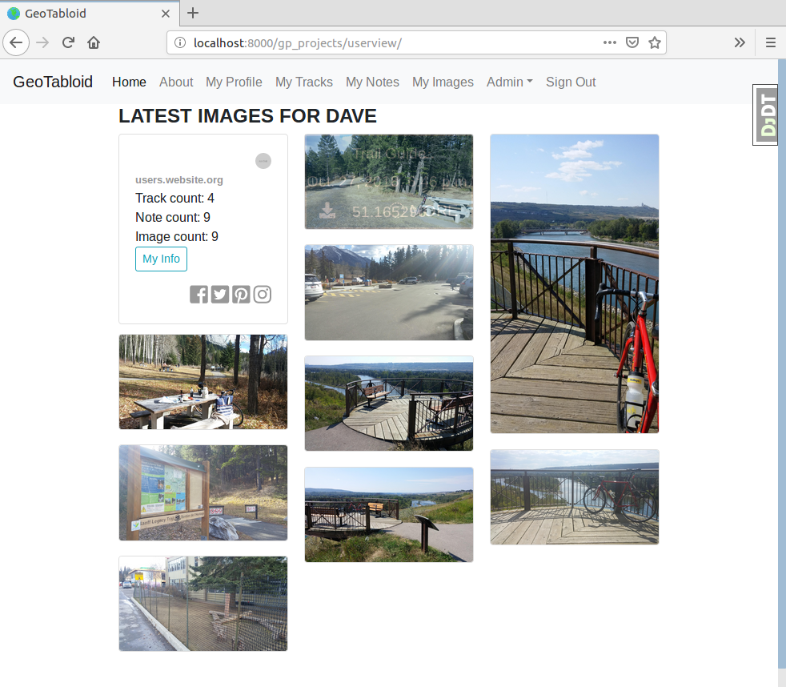
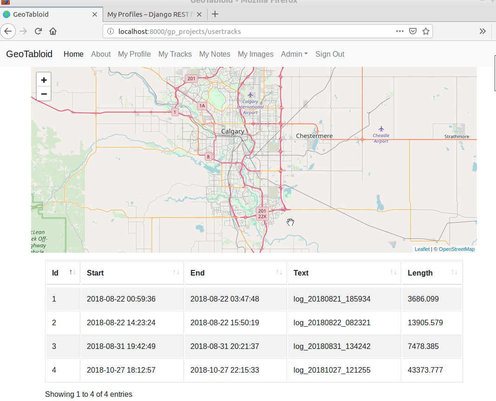
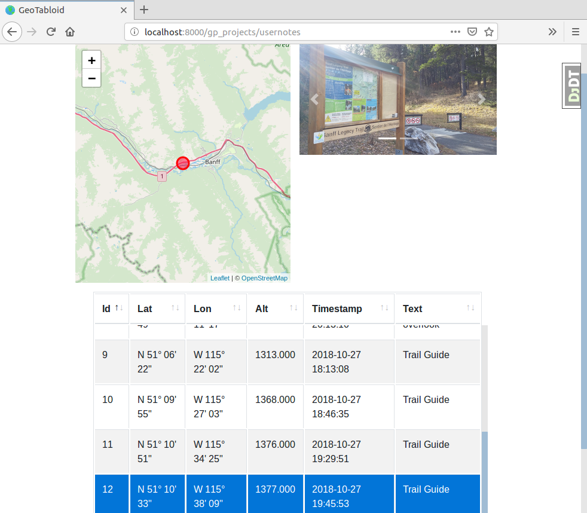
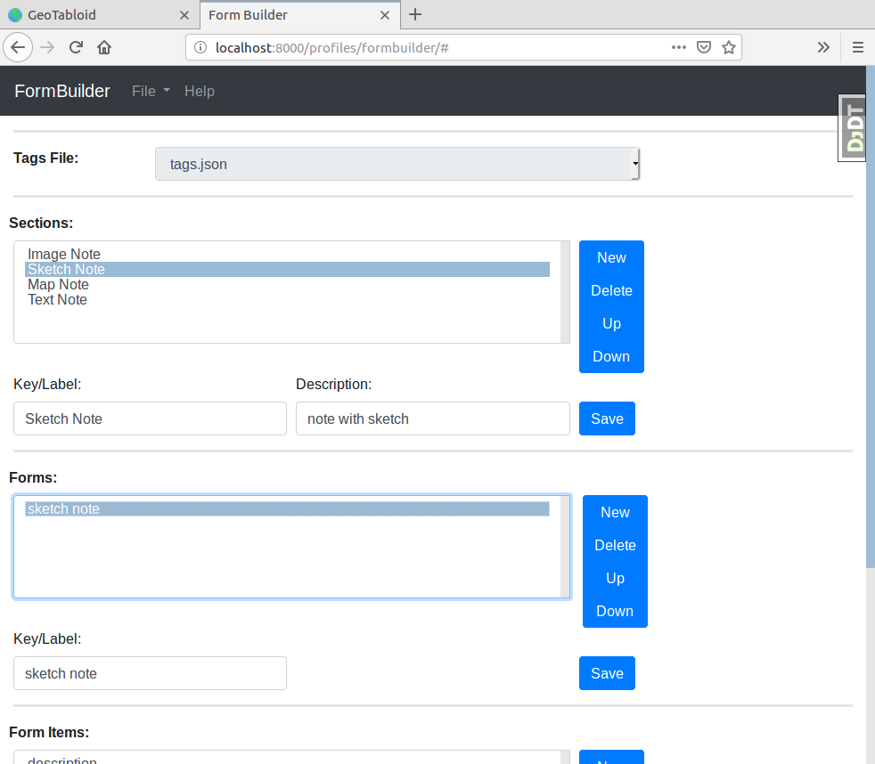

GeoTabloid
==========

A demonstration server for Geopaparazzi_ users.  Using Django_, Django-REST-Framework_ and PostGIS_ this service provides upload and download functions for the GeoPaparazzi app along with some useful templates for exploring the notes, tracks and photos that you collect.

.. _Geopaparazzi: https://github.com/geopaparazzi/geopaparazzi
.. _Django: https://www.djangoproject.com/
.. _Django-REST-Framework: https://www.django-rest-framework.org/
.. _PostGIS: https://postgis.net/

.. image:: https://img.shields.io/badge/built%20with-Cookiecutter%20Django-ff69b4.svg
     :target: https://github.com/pydanny/cookiecutter-django/
     :alt: Built with Cookiecutter Django

:License: MIT

Getting Started With A Local Server
^^^^^^^^^^^^^^^^^^^^^^^^^^^^^^^^^^^

Prerequisites
-------------

* Docker_ and Docker-compose_ (Linux) or Docker-desktop_ (Windows or Mac)
* Httpie_ or cUrl_

.. _Docker: https://www.docker.com/products
.. _Docker-compose: https://docs.docker.com/compose/install/
.. _Docker-desktop: https://www.docker.com/products/docker-desktop
.. _Httpie: https://httpie.org/
.. _cUrl: https://curl.haxx.se/

Clone the repo and build the docker containers
----------------------------------------------

::

    $ git clone https://github.com/geoanalytic/geotabloid.git
    $ cd geotabloid
    $ docker-compose -f local.yml build
    $ docker-compose -f local.yml up -d
    $ docker-compose -f local.yml ps

Depending on how you have installed docker, you may need to preface the docker-compose commands with sudo.
For example, if you get:
::

    ERROR: couldn't connect to Docker daemon at http+docker://localhost - is it running?

try prefacing the docker-compose commands with sudo.

The ps command should result in a report like this:

::

               Name                         Command               State           Ports
 -------------------------------------------------------------------------------------------
 geotabloid_celerybeat_1     /entrypoint /start-celerybeat    Up
 geotabloid_celeryworker_1   /entrypoint /start-celeryw ...   Up
 geotabloid_django_1         /entrypoint /start               Up      0.0.0.0:8000- 8000/tcp
 geotabloid_flower_1         /entrypoint /start-flower        Up      0.0.0.0:5555- 5555/tcp
 geotabloid_postgres_1       /bin/sh -c /docker-entrypo ...   Up      5432/tcp
 geotabloid_redis_1          docker-entrypoint.sh redis ...   Up      6379/tcp

So long as the state of all the containers is Up, we are good to go.

Create a superuser and run the tests
------------------------------------

::

    $ docker-compose -f local.yml run --rm django python manage.py migrate
    $ docker-compose -f local.yml run --rm django python manage.py collectstatic
    Starting geotabloid_postgres_1 ... done
    PostgreSQL is available

    You have requested to collect static files at the destination
    location as specified in your settings:

        /app/staticfiles

    This will overwrite existing files!
    Are you sure you want to do this?

    Type 'yes' to continue, or 'no' to cancel: yes
    ...
    $ docker-compose -f local.yml run --rm django python manage.py createsuperuser
    Starting geotabloid_postgres_1 ... done
    PostgreSQL is available
    Username: dave
    Email address: test@test.com
    Password:
    Password (again):
    Superuser created successfully.

    $ docker-compose -f local.yml run --rm django py.test

The py.test command should result in a report like this:

::

 Starting geotabloid_postgres_1 ... done
 PostgreSQL is available
 Test session starts (platform: linux, Python 3.6.5, pytest 3.8.0, pytest-sugar 0.9.1)
 Django settings: config.settings.test (from ini file)
 rootdir: /app, inifile: pytest.ini
 plugins: sugar-0.9.1, django-3.4.3, celery-4.2.1
 
  geotabloid/users/tests/test_forms.py ✓                                                                                       2% ▎
  geotabloid/users/tests/test_models.py ✓                                                                                      4% ▍
  geotabloid/users/tests/test_urls.py ✓✓✓✓                                                                                    11% █▏
  geotabloid/users/tests/test_views.py ✓✓✓                                                                                    16% █▋
  gp_projects/tests/test_models.py ✓✓✓                                                                                        21% ██▏
  profiles/tests/test_api.py ✓✓✓✓✓✓✓✓✓✓✓✓✓✓✓✓✓✓✓✓✓✓✓                                                                          61% ██████▎
  profiles/tests/test_models.py ✓✓✓✓✓✓✓✓✓✓✓✓✓✓✓✓✓✓✓✓✓✓                                                                       100% ██████████
 
 Results (6.27s):
       57 passed

Open a browser and point it at http://localhost:8000 and you should see a welcome page like this:

Click on the 'Sign In' menu item and enter the superuser name and password you entered above.  Because we are running locally, there is no confirmation email being sent, so you will need to look in the logs for the link

::

    $ docker-compose -f local.yml logs django

    django_1        | 172.17.0.1 - - [12/Feb/2019 00:03:37] "GET / HTTP/1.1" 200 -
    django_1        | 172.17.0.1 - - [12/Feb/2019 00:03:37] "GET /static/images/output013.png HTTP/1.1" 304 -
    django_1        | 172.17.0.1 - - [12/Feb/2019 00:03:37] "GET /static/images/output014.png HTTP/1.1" 304 -
    django_1        | 172.17.0.1 - - [12/Feb/2019 00:03:38] "GET /accounts/login/ HTTP/1.1" 200 -
    django_1        | Content-Type: text/plain; charset="utf-8"
    django_1        | MIME-Version: 1.0
    django_1        | Content-Transfer-Encoding: 7bit
    django_1        | Subject: [GeoTabloid] Please Confirm Your E-mail Address
    django_1        | From: webmaster@localhost
    django_1        | To: test@test.com
    django_1        | Date: Tue, 12 Feb 2019 00:03:41 -0000
    django_1        | Message-ID: <154992982130.60.2032796483362449740@b8c2d959abf6>
    django_1        |
    django_1        | Hello from GeoTabloid!
    django_1        |
    django_1        | You're receiving this e-mail because user dave has given yours as an e-mail address to connect their account.
    django_1        |
    django_1        | To confirm this is correct, go to http://localhost:8000/accounts/confirm-email/MQ:1gtLY5:zDrrkmM5TmknhfeIP_20uptlHXo/
    django_1        |
    django_1        | Thank you from GeoTabloid!
    django_1        | trailstewards.com

Copy the confirmation link into your browser address bar and you should get a confirmation screen and be logged in.

Load the demo data
------------------

Now load the demo data files, which are in the profiles/fixtures folder.  There are shell scripts there to use either Httpie_ or cUrl_, you only need to execute one of these. but before you begin, edit the file and replace user:password with the username and password you supplied for the superuser.
Execute this command from the fixtures folder.

::

    $ cd profiles/fixtures
    $ ./load_httpie.sh

Returning to the main GeoTabloid folder, load the fixture data to connect up the demo data to the superuser account.

::

    $ cd ../..
    $ docker-compose -f local.yml run --rm django python manage.py loaddata profiles/fixtures/minimal.json
    Installed 2 object(s) from 1 fixture(s)

Finally, in your browser, select the Admin | Database Admin menu item.  This should open a Django Administration window like this:

For a local server, the base URL of the server needs to have the IP address filled in.  The Django Administration tool makes this pretty easy.  Click on Projects and click the /geotabloid/geotabloid_demo.gpap link.  This will give you a page like this:

If you look at the Uploadurl field, you will see that this is not a valid url.  In a production system, this url is automatically filled in.  Edit this string using the IP address of your server so the field looks like this:

Click the Save button to update the database.  In this case, the IP address for my laptop is 172.17.195.254.  Yours will likely be different, on Linux, use ifconfig to find the value.  On Windows the command is ipconfig.

Now, open your browser and point it to http://localhost:8000/profiles/myprofiles/
You should see a page like this:

.. image:: ./img/myprofiles.png

This shows the REST api that the Geopaparazzi app will access to download the cloud profile data.  If you refer to the home page, there are instructions for installing and setting up the app to use GeoTabloid.
The only thing that you need to adjust is the string that you enter in the Cloud Profiles URL setting.  For this, you need the IP address of your computer.  Assuming it is something like 172.17.195.254, then you should enter:
::
    http://172.17.195.254:8000/profiles/myprofiles/

Now, go ahead and use Geopaparazzi to collect images, notes and tracks.  When you are done, upload the cloud profile data (note your phone must be on the same network as your server).
Once you have completed the upload, the server will index and process the data which is then available for you to view and download.  See the example screenshots below:

User info and recent photo uploads are shown on the My Profile page.

A selectable list of tracks and a map display is shown on the My Tracks page.

Similar lists and maps are shown on the My Notes and My Images pages.

A form builder app is supplied to allow you to create Geopaparazzi forms (tags)

