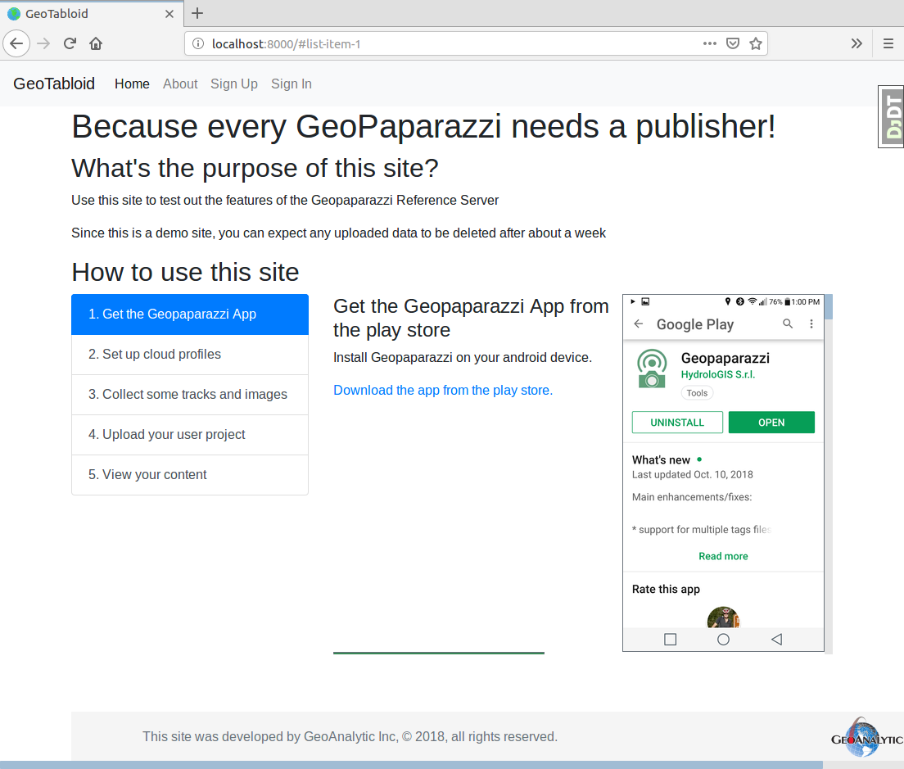
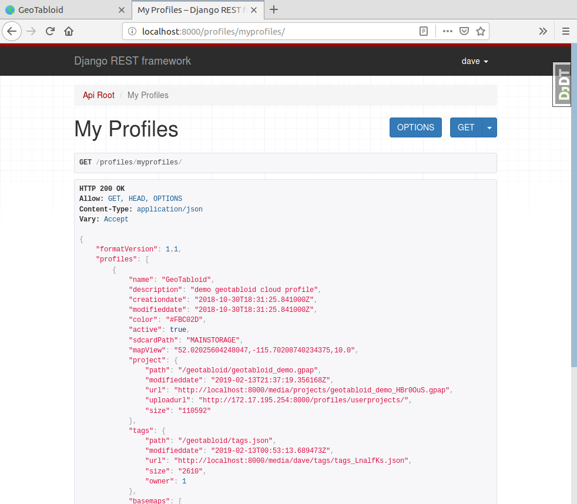

GeoTabloid
==========

A demonstration server for GeoPaparazzi users.  Using Django_, Django REST Framework_ and PostGIS_ this service provides upload and download functions for the GeoPaparazzi app along with some useful templates for exploring the notes, tracks and photos that you collect.

.. Django: https://www.djangoproject.com/
.. Django REST Framework: https://www.django-rest-framework.org/
.. PostGIS: https://postgis.net/

.. image:: https://img.shields.io/badge/built%20with-Cookiecutter%20Django-ff69b4.svg
     :target: https://github.com/pydanny/cookiecutter-django/
     :alt: Built with Cookiecutter Django

:License: MIT

Getting Started With A Local Server
^^^^^^^^^^^^^^^^^^^^^^^^^^^^^^^^^^^

Prerequisites
-------------

* Docker_ and Docker-compose_ (Linux) or Docker-desktop (Windows or Mac)
* Httpie_ or cUrl_

.. _Docker: https://www.docker.com/products
.. _Docker-compose: https://docs.docker.com/compose/install/
.. _Httpie: https://httpie.org/
.. _cUrl: https://curl.haxx.se/

Clone the repo and build the docker containers
----------------------------------------------

::

    $ git clone https://github.com/geoanalytic/geotabloid.git
    $ cd geotabloid
    $ docker-compose -f local.yml build
    $ docker-compose -f local.yml up -d
    $ docker-compose -f local.yml ps

Depending on how you have installed docker, you may need to preface the docker-compose commands with sudo.
The ps command should result in a report like this.

::

               Name                         Command               State           Ports
 -------------------------------------------------------------------------------------------
 geotabloid_celerybeat_1     /entrypoint /start-celerybeat    Up
 geotabloid_celeryworker_1   /entrypoint /start-celeryw ...   Up
 geotabloid_django_1         /entrypoint /start               Up      0.0.0.0:8000- 8000/tcp
 geotabloid_flower_1         /entrypoint /start-flower        Up      0.0.0.0:5555- 5555/tcp
 geotabloid_postgres_1       /bin/sh -c /docker-entrypo ...   Up      5432/tcp
 geotabloid_redis_1          docker-entrypoint.sh redis ...   Up      6379/tcp

So long as the state of all the containers is Up, we are good to go.

Create a superuser and run the tests
------------------------------------

::

    $ docker-compose -f local.yml run --rm django python manage.py migrate
    $ docker-compose -f local.yml run --rm django python manage.py collectstatic
    Starting geotabloid_postgres_1 ... done
    PostgreSQL is available

    You have requested to collect static files at the destination
    location as specified in your settings:

        /app/staticfiles

    This will overwrite existing files!
    Are you sure you want to do this?

    Type 'yes' to continue, or 'no' to cancel: yes
    ...
    $ docker-compose -f local.yml run --rm django python manage.py createsuperuser
    Starting geotabloid_postgres_1 ... done
    PostgreSQL is available
    Username: dave
    Email address: test@test.com
    Password:
    Password (again):
    Superuser created successfully.

    $ docker-compose -f local.yml run --rm django py.test

The py.test command should result in a report like this:

::

 Starting geotabloid_postgres_1 ... done
 PostgreSQL is available
 Test session starts (platform: linux, Python 3.6.5, pytest 3.8.0, pytest-sugar 0.9.1)
 Django settings: config.settings.test (from ini file)
 rootdir: /app, inifile: pytest.ini
 plugins: sugar-0.9.1, django-3.4.3, celery-4.2.1
 
  geotabloid/users/tests/test_forms.py ✓                                                                                       2% ▎
  geotabloid/users/tests/test_models.py ✓                                                                                      4% ▍
  geotabloid/users/tests/test_urls.py ✓✓✓✓                                                                                    11% █▏
  geotabloid/users/tests/test_views.py ✓✓✓                                                                                    16% █▋
  gp_projects/tests/test_models.py ✓✓✓                                                                                        21% ██▏
  profiles/tests/test_api.py ✓✓✓✓✓✓✓✓✓✓✓✓✓✓✓✓✓✓✓✓✓✓✓                                                                          61% ██████▎
  profiles/tests/test_models.py ✓✓✓✓✓✓✓✓✓✓✓✓✓✓✓✓✓✓✓✓✓✓                                                                       100% ██████████
 
 Results (6.27s):
       57 passed

Open a browser and point it at http://localhost:8000 and you should see a welcome page like this:

Click on the 'Sign In' menu item and enter the superuser name and password you entered above.  Because we are running locally, there is no confirmation email being sent, so you will need to look in the logs for the link

::

    $ docker-compose -f local.yml logs django

    django_1        | 172.17.0.1 - - [12/Feb/2019 00:03:37] "GET / HTTP/1.1" 200 -
    django_1        | 172.17.0.1 - - [12/Feb/2019 00:03:37] "GET /static/images/output013.png HTTP/1.1" 304 -
    django_1        | 172.17.0.1 - - [12/Feb/2019 00:03:37] "GET /static/images/output014.png HTTP/1.1" 304 -
    django_1        | 172.17.0.1 - - [12/Feb/2019 00:03:38] "GET /accounts/login/ HTTP/1.1" 200 -
    django_1        | Content-Type: text/plain; charset="utf-8"
    django_1        | MIME-Version: 1.0
    django_1        | Content-Transfer-Encoding: 7bit
    django_1        | Subject: [GeoTabloid] Please Confirm Your E-mail Address
    django_1        | From: webmaster@localhost
    django_1        | To: test@test.com
    django_1        | Date: Tue, 12 Feb 2019 00:03:41 -0000
    django_1        | Message-ID: <154992982130.60.2032796483362449740@b8c2d959abf6>
    django_1        |
    django_1        | Hello from GeoTabloid!
    django_1        |
    django_1        | You're receiving this e-mail because user dave has given yours as an e-mail address to connect their account.
    django_1        |
    django_1        | To confirm this is correct, go to http://localhost:8000/accounts/confirm-email/MQ:1gtLY5:zDrrkmM5TmknhfeIP_20uptlHXo/
    django_1        |
    django_1        | Thank you from GeoTabloid!
    django_1        | trailstewards.com

Copy the confirmation link into your browser address bar and you should get a confirmation screen and be logged in.

Load the demo data
------------------

Now load the demo data files, which are in the profiles/fixtures folder.  There are shell scripts there to use either Httpie or cUrl, you only need to execute one ot these. but before you begin, edit the file and replace user:password with the username and password you supplied for the superuser.
Execute this command from the fixtures folder.

::

    $ cd profiles/fixtures
    $ ./load_httpie.sh

Returning to the main GeoTabloid folder, load the fixture data to connect up the demo data to the superuser account.

::

    $ cd ../..
    $ docker-compose -f local.yml run --rm django python manage.py loaddata profiles/fixtures/minimal.json
    Installed 2 object(s) from 1 fixture(s)

Now, open your browser and point it to http://localhost:8000/profiles/myprofiles/
You should see a page like this:

